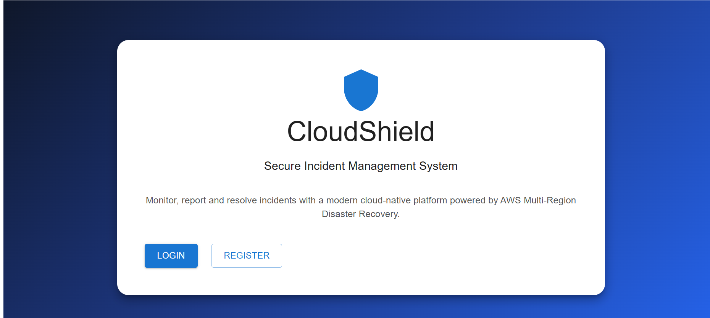
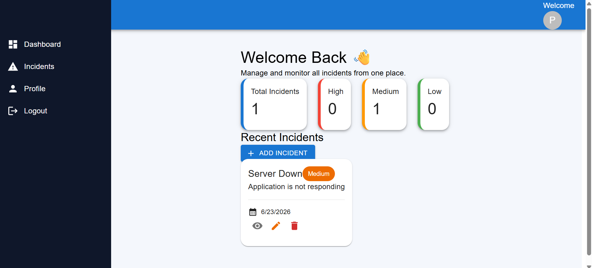
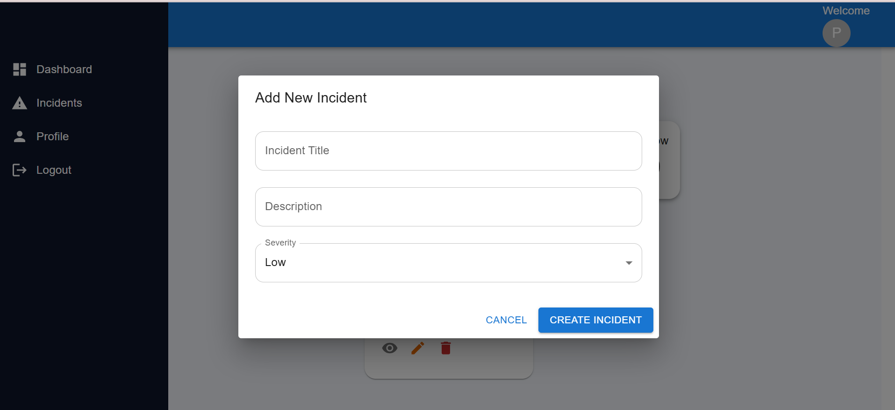
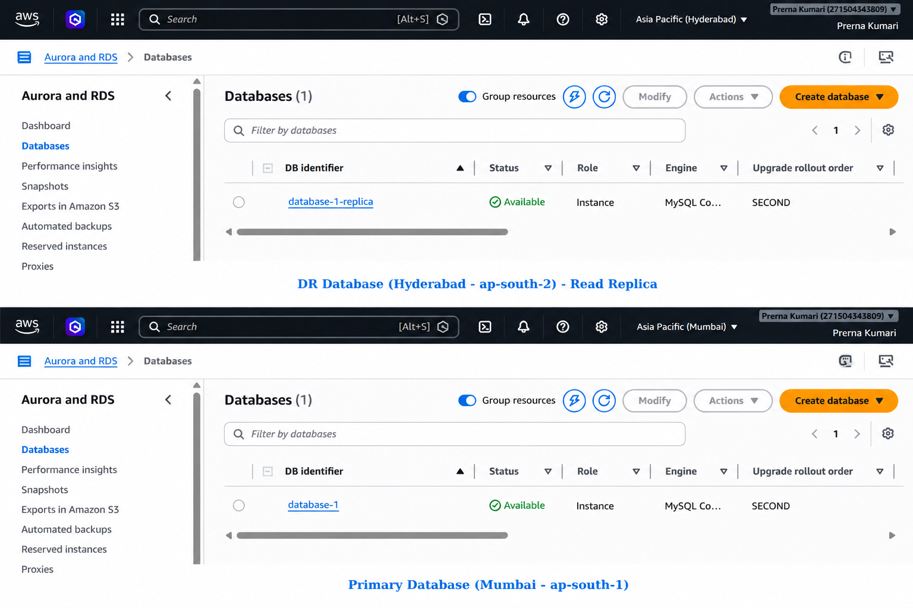
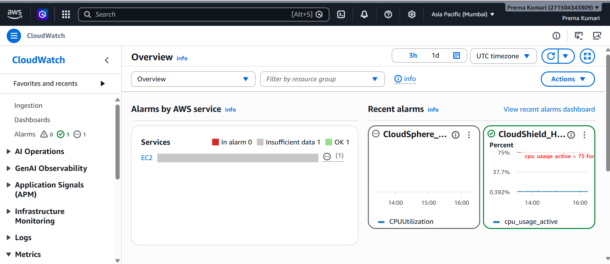

# ☁️ CloudShield – Multi-Region Disaster Recovery Platform

CloudShield is a full-stack cloud-native incident management platform designed with a disaster recovery architecture on AWS.

The project demonstrates how a web application can remain highly available by deploying infrastructure across multiple AWS regions. It includes cross-region database replication, monitoring with Amazon CloudWatch, alerting using Amazon SNS, and a secondary deployment that can take over during regional failures.

The application allows authenticated users to manage incidents through a modern React dashboard while showcasing production-oriented AWS deployment practices.

## Key Highlights

- 🌍 Multi-Region Deployment (Mumbai & Hyderabad)
- 🔐 JWT Authentication
- 📝 Incident Management (Create, Read, Update, Delete)
- 💾 Amazon RDS MySQL
- 🔄 Cross-Region Disaster Recovery Architecture
- 📊 Amazon CloudWatch Monitoring
- 📧 Amazon SNS Alerts
- ⚡ PM2 Process Management
- 🌐 Nginx Reverse Proxy
- 🔒 Environment Variable Configuration
- ---

# 🏗 Architecture

<p align="center">

</p>

---

# 🔄 Disaster Recovery Workflow

CloudShield is deployed across **two AWS regions**.

- **Primary Region:** Mumbai
- **Disaster Recovery Region:** Hyderabad

The application is hosted in both regions while Amazon CloudWatch continuously monitors infrastructure health. Whenever a configured threshold is exceeded, Amazon SNS immediately sends email notifications to administrators.

The architecture is designed to minimize downtime during infrastructure failures and can be extended with Route 53 failover routing for automatic traffic redirection.

---

# ☁ AWS Infrastructure

| Service | Purpose |
|----------|---------|
| Amazon EC2 | Hosts the frontend and backend applications |
| Amazon RDS | MySQL database |
| Amazon CloudWatch | Resource monitoring |
| Amazon SNS | Email alerts |
| IAM | Secure access management |
| Security Groups | Network security |
| Nginx | Reverse Proxy |
| PM2 | Backend Process Manager |

---

# 🛠 Tech Stack

| Category | Technology |
|-----------|------------|
| Frontend | React.js + Vite |
| Backend | Node.js + Express.js |
| Database | MySQL |
| Authentication | JWT |
| Cloud Platform | AWS |
| Monitoring | Amazon CloudWatch |
| Notifications | Amazon SNS |
| Web Server | Nginx |
| Process Manager | PM2 |
| Version Control | Git & GitHub |

---

# 📂 Project Structure

```text
CloudShield
│
├── frontend
│   ├── public
│   ├── src
│   ├── package.json
│   └── vite.config.js
│
├── backend
│   ├── config
│   ├── controllers
│   ├── middleware
│   ├── routes
│   ├── utils
│   ├── server.js
│   └── package.json
│
└── README.md
```

---

# 📸 Application Screenshots

## Login

<p align="center">

</p>

---

## Dashboard

<p align="center">

</p>

---

## Add Incident

<p align="center">

</p>

---

# ☁ AWS Deployment Screenshots

## EC2 Instances

<p align="center">

</p>

---

## Amazon RDS

<p align="center">

</p>

---

## CloudWatch Alarm

<p align="center">

</p>

---


## PM2 Process Status

<p align="center">

</p>


# 🚀 Local Installation

### Clone Repository

```bash
git clone [https://github.com/prerna1113/CloudShield-MutliReion]
```

### Backend

```bash
cd backend
npm install
npm run dev
```

### Frontend

```bash
cd frontend
npm install
npm run dev
```

---

# 🔐 Environment Variables

Create a `.env` file inside both the **backend** and **frontend** directories.

### Backend

```env
DB_HOST=
DB_USER=
DB_PASSWORD=
DB_NAME=
DB_PORT=

JWT_SECRET=
```

### Frontend

```env
VITE_API_URL=
```

---

# 🎯 Future Enhancements

- Route 53 Failover Routing
- HTTPS with Let's Encrypt
- Terraform Infrastructure as Code
- Application Load Balancer
- Auto Scaling Group
- CI/CD using GitHub Actions

---

# 👩‍💻 Author

**Prerna Dubey**

MCA Student | AWS Cloud | MERN Stack Developer

GitHub: https://github.com/prerna1113

---

## ⭐ If you found this project helpful, consider giving it a star.
